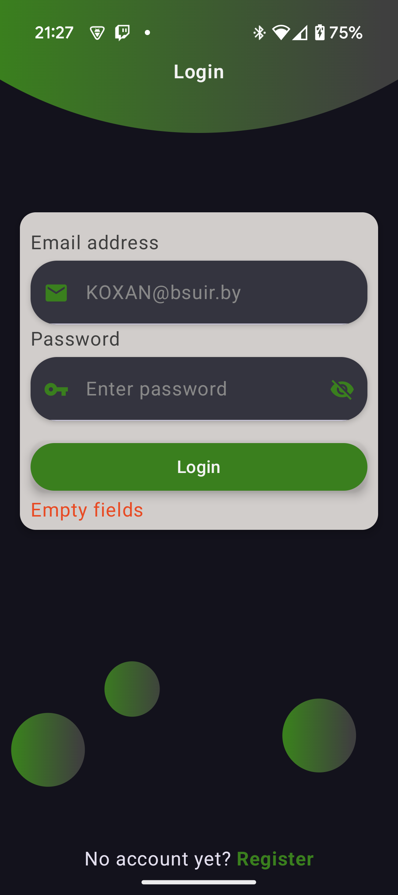

# Разработка приложения «Управление финансовой системой» 

## Cтек: Kotlin + Jetpack Compose + SqLite (room libary) 

## В проекты также были применены паттерны проектирования MVVM и DI (dagger-hilt library)

### Авторизация и регистрация

Для **авторизации** пользователю необходимо быть зарегистрированным в системе и произвести вход с помощью почты и пароля. Тут имеются проверки на ввод для **корректности данных введённых** от пользователя

Для **регистрации** пользователю необходимо ввести ФИО, номер телефона, серию и номер паспорта с идентификационным номером паспорта, почту и пароль

### Клиент

После авторизации пользователь попадёт в свой аккаунт на **экран профиля**. Снизу имеется BottomNavigarionBar для удобного перемещения по функциональным страничкам пользователя

Здесь представлены **банковские счета** пользователя. 
Пользователь также может без труда **создать новый банковский счёт** в любом из предложенных системой банков или же **открыть кредитный счёт** на выбранный срок с процентной ставкой заданной банком

Обратите внимание на IconButton, который изменил своё состояние. Это всё потому что пользователь может по клику **заморозить счёт** или же обратно перевести его в **активный статус**.
Замороженный счёт не может отправлять денежные средства, только получать.
Но есть нюанс счёт может быть заблокирован менеджером или оператором, но об этом чуть позже.
Лучше взглянуть на ещё один IconButton в виде значка **$** — при нажатии на него откроется **окно для перевода средств** на выбранный банковский счёт.

Возле надписи о типе банковского счёта, можно нажать на значок Info, который раскроет **более подробную информацию** о данном банковском счёте

Тут всё просто клиент может **подавать** или же **отзывать** заявку на свободные **зарплатные проекты**, которые были подтверждены менеджером или оператором финансовой системы

### Специалист предприятия

Перейдём к другому пользователю — специалисту предприятия, который выполняет роль бухгалтера компании.
В разделе "Счета", он очень похож на раздел клиента, за исключением того, что **корпорационный счёт** привязан к определённой компании

А вот в разделе зарплатных проектов поинтереснее, тут можно **создать зарплатный проект**, который позже может обработать менеджер или же оператор (подтвердить или отклонить)

### Менеджер/Оператор

Рассмотрим только менеджера, так как он имеет все функции оператора и ещё свои.
В разделе "Счета" менеджер может **заблокировать банковский счёт**, после чего клиент не сможет перевести его в первоначальное состояние и тем более отправлять переводы денежных средств.

Также в этом разделе есть функционал для работы с **кредитными счетами** — менеджер может **отклонить** или **одобрить** их.

В разделе "переводы" можно наблюдать **все переводы произведённые пользователями** финансовой системы. 
Менеджер обладает правами **отмены переводов**, после чего у перевода изменится статус, а деньги будут возвращены отправителю

Ну тут всё просто, **подтвержение** или **отклонение запросов на зарплатные проекты** от различных компаний

### Администратор

Здесь администратор системы может **просматривать логи**, фактически каждое действие которое было совершено любым из пользователей финансовой системы

Кроме того, он может **удалять все данные**, созданные пользователями (банковские счета, переводы, зарплатные проекты)

